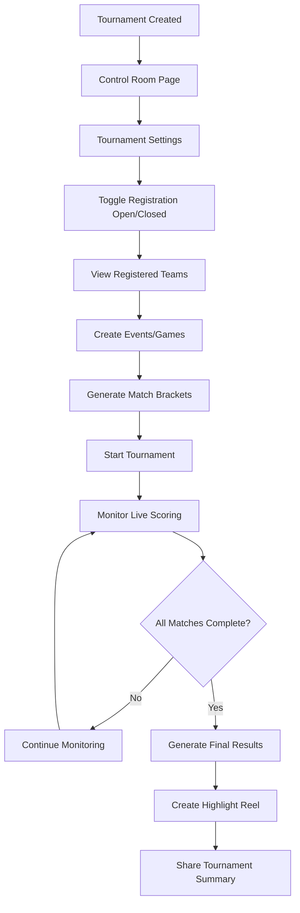

# Beer Olympics User Journey Flows

## 1. Tournament Organizer Journey

```mermaid
flowchart TD
    A[Homepage] --> B{User Signed In?}
    B -->|No| C[Click "Create Tournament"]
    C --> D[Sign In with Google]
    D --> E[Redirected to Create Page]
    B -->|Yes| E
    E --> F[Fill Tournament Details]
    F --> G[Enter Tournament Name]
    G --> H[Select Tournament Date]
    H --> I[Click "Create Tournament"]
    I --> J[Tournament Created]
    J --> K[Redirect to Control Room]
    K --> L[Share Tournament Code]
    L --> M[Manage Teams & Settings]
    M --> N[Start Tournament]
    N --> O[Monitor Live Scoring]
    O --> P[View Results & Highlights]
```

## 2. Player/Team Journey

```mermaid
flowchart TD
    A[Receive Tournament Code] --> B[Visit Homepage]
    B --> C[Enter Tournament Code]
    C --> D[Click "Join Tournament"]
    D --> E[Tournament Join Page]
    E --> F{User Signed In?}
    F -->|No| G[Enter Name Manually]
    F -->|Yes| H[User Info Auto-filled]
    G --> I[Enter Team Name]
    H --> I
    I --> J[Select Team Color]
    J --> K[Select Team Flag]
    K --> L[Click "Create Team"]
    L --> M[Team Created Successfully]
    M --> N[Redirect to Dashboard]
    N --> O[View Upcoming Matches]
    O --> P[Submit Scores]
    P --> Q[Upload Media]
    Q --> R[View Live Leaderboard]
    R --> S[Celebrate Victory! 🏆]
```

## 3. Authentication Flow

```mermaid
flowchart TD
    A[User Clicks "Sign In"] --> B[Redirect to OAuth Provider]
    B --> C[Google OAuth Screen]
    C --> D{User Approves?}
    D -->|Yes| E[Redirect to /auth/callback]
    D -->|No| F[Return to Previous Page]
    E --> G[Parse OAuth Response]
    G --> H[Store User Data]
    H --> I[Redirect to Original Page]
    I --> J[User Logged In]
    
    J --> K[User Clicks "Sign Out"]
    K --> L[Clear User Data]
    L --> M[Update UI State]
    M --> N[User Logged Out]
```

## 4. Tournament Management Flow



## 5. Scoring & Competition Flow

```mermaid
flowchart TD
    A[Match Begins] --> B[Team Captain Reports Score]
    B --> C[Score Submission Pending]
    C --> D[Notify Opposing Team]
    D --> E{Opponent Confirms?}
    E -->|Yes| F[Score Confirmed]
    E -->|No| G[Score Disputed]
    E -->|Timeout (5min)| H[Auto-Confirm Score]
    F --> I[Update Leaderboard]
    H --> I
    G --> J[Admin Review Required]
    J --> K[Manual Resolution]
    K --> I
    I --> L[Real-time UI Updates]
    L --> M[Match Complete]
    M --> N[Upload Match Media]
    N --> O[Generate Match Highlights]
```

## 6. Page Navigation Map

```mermaid
graph TD
    A[/ - Homepage] --> B[/create - Create Tournament]
    A --> C[/join/:slug - Join Tournament]
    A --> D[/test - Test Page]
    
    B --> E[/control/:slug - Control Room]
    C --> F[/dashboard/:slug - Team Dashboard]
    
    E --> G[/leaderboard/:slug - Live Leaderboard]
    F --> G
    E --> H[/display/:slug - TV Display Mode]
    F --> H
    
    A --> I[/auth/callback - OAuth Callback]
    
    style A fill:#f9f,stroke:#333,stroke-width:4px
    style B fill:#bbf,stroke:#333,stroke-width:2px
    style C fill:#bbf,stroke:#333,stroke-width:2px
    style E fill:#bfb,stroke:#333,stroke-width:2px
    style F fill:#bfb,stroke:#333,stroke-width:2px
    style G fill:#ffb,stroke:#333,stroke-width:2px
    style H fill:#ffb,stroke:#333,stroke-width:2px
```

## Key User Personas

### 🏆 Tournament Organizer
- **Goal**: Create and manage a seamless tournament experience
- **Pain Points**: Complex setup, manual scoring, lack of engagement
- **Solutions**: One-click setup, automated features, real-time updates

### 🎯 Team Captain
- **Goal**: Compete, track progress, and celebrate wins
- **Pain Points**: Confusing sign-up, delayed results, poor communication
- **Solutions**: Simple join flow, instant updates, clear leaderboards

### 📱 Team Member
- **Goal**: Participate and stay informed
- **Pain Points**: Missing updates, can't contribute
- **Solutions**: Real-time notifications, media uploads, bonus challenges

### 📺 Spectator
- **Goal**: Follow the action and cheer for favorites
- **Pain Points**: Can't see live scores, no highlights
- **Solutions**: Public leaderboards, TV display mode, auto-generated reels